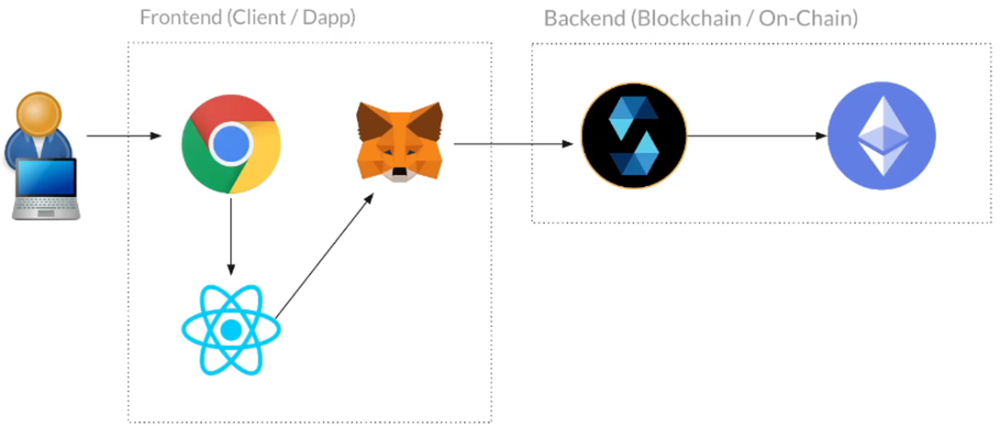
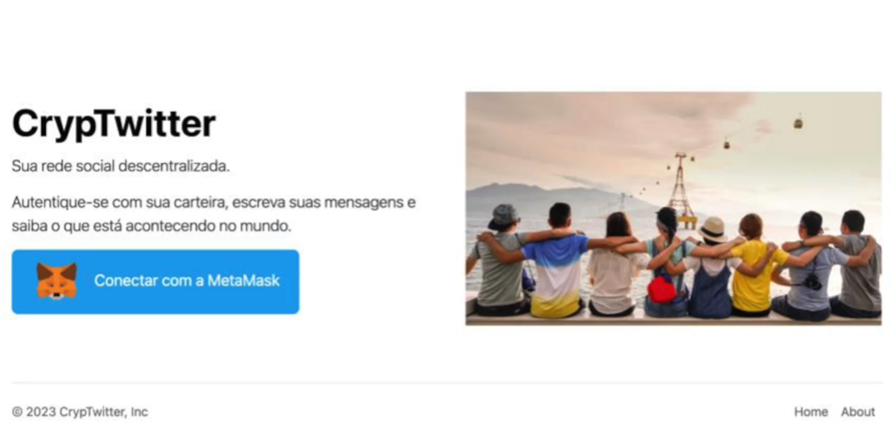
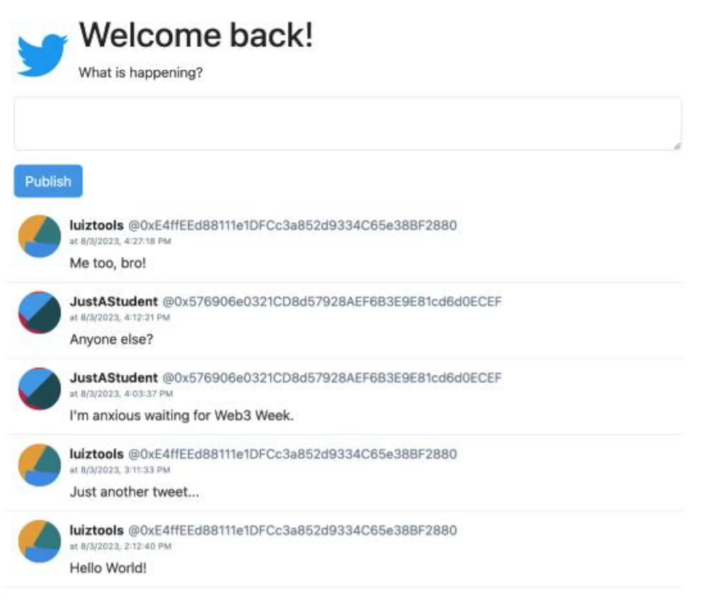
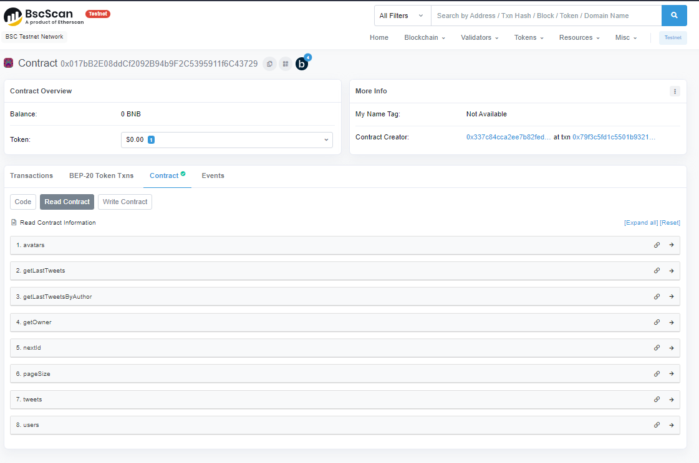

# web3-week-2

Learn in one week how to program blockchain applications from scratch and become a desired Web3 programmer.

Project from the second Web3 Week (07-aug-23): [Luiz Tools](https://www.luiztools.com.br/ "Luiz Tools")

    
     Project Architecture

    
     Initial Home Page

    
     Tweets Page

Contract published on [TestNet BSC](https://testnet.bscscan.com/address/0x017bB2E08ddCf2092B94b9F2C5395911f6C43729)
Contract published also on [Goerli Testnet](https://goerli.etherscan.io/address/0x732091390aF71AC311144171056B556213b2E0d8#readContract)

## Manage Wallet (Metamask)

* Add Metamask to Browser
* Configure TestNet BSC to Wallet
  * https://testnet.bscscan.com/
  * Click "Add BSC Network" button in the page footer
* Add coins to Wallet (by faucet)
  * https://testnet.bnbchain.org/faucet-smart

## Verify & Publish Contract Source Code

On BSC Scan Page, select contract and "Verify & Publish".

This will be able your contract to test by BSC Scan Web Interface:

    
     BSC Scan Test Contract

## Folders in this repository

* [**smart-contract**](./smart-contract/): Our CrypTwitter.sol smart contract.
* [**dapp**](./dapp/): Our CrypTwitter web3 frontend.

## Proposed challenges

**Class 1**
- [X] Have a mapping and allow the definition of the user's photo (URL of an image);
- [X] The pagination is dynamic, defined by the contract administrator;
- [ ] function to return only tweets from a specific user;

**Class 2**
- [X] Deploy on another blockchain (suggestions: Avalanche, Polygon or Goerli);
- [X] Use useEffect and localStorage to save and detect that the user is already authenticated in the frontend, without having to press the button;

## 📄 License

Code released under the [MIT License](./LICENSE).

Make by [Leonardo Cairo](https://www.linkedin.com/in/leocairos/)!